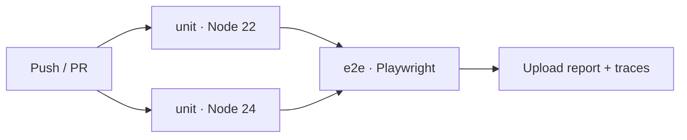

<div align="center">

# 🎯 Wheel Decider

#### Stop deliberating. Add your options, spin the wheel, and let chance settle it.

[](https://github.com/ismailbimbashov/Wheel-Decide/actions/workflows/ci.yml)
[](#-testing)
[](#-testing)
[](package.json)
[](LICENSE)

</div>

---

## 🛠️ Built With

<div align="center">


</div>

---

## 📖 Overview

Wheel Decider is a spinning-wheel randomiser that runs entirely in your browser. You type in the options, press **Spin**, and a pointer picks one. Your wheel is saved to `localStorage`, so it is still there when you come back.

**Why you might want it.** It is genuinely dependency-free at runtime — no framework, no bundler, no CDN calls, no tracking, no network requests of any kind. Clone it and open it, or drop the `src/` folder on any static host. The logic is separated into pure, fully-tested modules, so it is a small, readable example of testing browser code without a DOM.

**Why you might not.** It is a single-page toy with no accounts, no sharing, and no sync — a wheel is private to one browser on one device. Segment editing goes through native `prompt()` dialogs rather than inline UI. There is no weighting: every slice has equal odds.

---

## ✨ Features

- 🎡 **Spin to decide** — an eased 3.2 s animation, guarded against overlapping spins, with the winner read from a fixed pointer
- ➕ **Build your own wheel** — add, edit and delete segments; labels are trimmed and length-bounded
- 🔄 **Start fresh** — one confirmed click clears every segment and the saved state
- 💾 **Remembers your wheel** — persisted to `localStorage` and restored on the next visit
- 🛡️ **Survives corrupted saves** — truncated JSON, non-arrays and malformed records are discarded and repaired instead of crashing
- 🔤 **Always-readable labels** — auto-fitted to their slice and flipped past vertical so none render upside-down
- 🎨 **No two neighbouring colours match** — including the wrap-around seam where the last slice meets the first
- 🔍 **Sharp on HiDPI screens** — the canvas backing store scales with `devicePixelRatio`
- ♿ **Accessible** — semantic landmarks, a labelled input, a named canvas, visible focus, and an `aria-live` region that announces the result
- 📱 **Responsive, themed, motion-aware** — fluid layout with light and dark palettes and `prefers-reduced-motion` support
- 📦 **Zero runtime dependencies** — Playwright is the only dev dependency

---

## ⚡ Quick Start

```bash
git clone https://github.com/ismailbimbashov/Wheel-Decide.git
cd Wheel-Decide
npm start
```

Then open <http://localhost:8000>. No install step — the app itself has no dependencies.

> ⚠️ The app **must be served over HTTP**. Opening `src/index.html` via `file://` fails, because browsers block ES module imports on the file protocol.

---

<details>
<summary><b>📋 Detailed Setup Guide</b></summary>

### Prerequisites

| Tool | Version | Why |
|---|---|---|
| **Python** | 3.7+ | Only for `npm start`, which uses `python3 -m http.server --directory` |
| **A modern browser** | ES modules + Canvas 2D | Runs the app |
| **Node.js** | `>=22` (`engines` in [`package.json`](package.json)) | Only to run the test suites |

### Clone and install

```bash
git clone https://github.com/ismailbimbashov/Wheel-Decide.git
cd Wheel-Decide

# Only needed if you intend to run the tests
npm ci
npx playwright install chromium
```

### Environment variables

None. The application reads no environment variables and needs no `.env` file.

### Run the app

```bash
npm start          # serves src/ on http://localhost:8000
```

Any static server works instead — `npx serve src`, or the VS Code Live Server extension pointed at `src/`.

### Run the tests

```bash
npm run test:unit      # pure logic, no browser
npm run test:e2e       # Playwright, starts the server itself
npm run test:all       # both
```

</details>

---

<details>
<summary><b>📁 Project Structure</b></summary>

```
Wheel-Decider/
├── .github/
│   └── workflows/
│       └── ci.yml               # unit (Node 22/24 matrix) → e2e (Playwright)
├── src/                         # all authored source; also the deploy root
│   ├── index.html               # markup, icon links, module entry point
│   ├── main.js                  # DOM layer: canvas drawing, events, storage boundary
│   ├── core/                    # pure logic — no DOM, no globals, fully unit-tested
│   │   ├── storage.js           # hydration, validation, mutation, bounds checking
│   │   └── wheel.js             # geometry, easing, colour assignment, selection
│   ├── styles/
│   │   └── main.css             # design tokens, layout, light + dark themes
│   └── assets/
│       └── icons/               # SVG favicon + 16/32/48 PNGs + apple-touch icon
├── tests/
│   ├── unit/                    # node:test — 75 tests
│   │   ├── storage.test.js
│   │   └── wheel.test.js
│   └── e2e/                     # Playwright — 27 tests × 2 browser projects
│       ├── pages/
│       │   └── WheelPage.js     # Page Object — every locator by accessible name
│       ├── fixtures.js          # custom fixture; clears storage before each test
│       ├── wheel.spec.js        # build a wheel and spin it
│       ├── segments.spec.js     # add / edit / delete / reset
│       ├── resilience.spec.js   # boots from six hostile stored payloads
│       ├── accessibility.spec.js
│       └── layout.spec.js
├── playwright.config.js
├── package.json
├── LICENSE
└── README.md
```

Because there is no build step, `src/` is served as-is — it is both the source directory and the publish directory.

**The architectural spine** is the split between `src/main.js` and `src/core/`. Nothing in `core/` touches `window`, `document` or `localStorage`; anything needing persistence receives a storage object as an argument, and the browser API is named exactly once, in `main.js`:

```js
const storage = window.localStorage;   // the integration boundary
```

That single choice is what lets the entire data layer run under `node --test` with no DOM, no jsdom and no dependencies.

</details>

---

## 🧪 Testing

Two tiers. **Unit tests** cover pure logic with Node's built-in runner — no browser, no dependencies. **Playwright** drives the real app in a real browser.

```bash
npm run test:unit          # 75 tests, with enforced coverage thresholds
npm run test:e2e           # 54 runs (27 tests × 2 projects)
npm run test:all           # both, unit first

npm run test:e2e:ui        # Playwright UI mode — watch, filter, time-travel
npm run test:e2e:headed    # watch the browser drive itself
npm run test:report        # open the last HTML report

node --test "tests/unit/**/wheel.test.js"        # one unit file
npx playwright test tests/e2e/resilience.spec.js # one spec
```

### Coverage

| File | Lines | Branches | Functions |
|---|---|---|---|
| `src/core/storage.js` | 100.00% | 98.39% | 100.00% |
| `src/core/wheel.js` | 100.00% | 100.00% | 100.00% |
| **All files** | **100.00%** | **98.88%** | **100.00%** |

`npm run test:unit` enforces floors of **70% lines, 70% branches, 80% functions**. Node exits non-zero when any is unmet, so a coverage regression fails the build exactly like a failing assertion.

`src/main.js` is deliberately absent — it is the DOM layer, is never imported by a unit test, and is covered end-to-end by Playwright instead.

### What the E2E suite guards

| Spec | Covers |
|---|---|
| `wheel.spec.js` | First visit, adding segments, spinning, empty-input rejection, persistence across reload |
| `segments.spec.js` | Editing and deleting **the first segment** (a past off-by-one made it unreachable), out-of-range rejection, cancel-safety, wheel reset |
| `resilience.spec.js` | Booting from six hostile stored payloads with zero uncaught exceptions, then staying usable |
| `accessibility.spec.js` | Single H1, named canvas, live region, full keyboard reachability, visible focus |
| `layout.spec.js` | No horizontal scroll, nothing clipped off-viewport, HiDPI backing store |

Every locator resolves by **accessible name** (`getByRole`, `getByLabel`) — never by CSS position or DOM structure. A broken locator is therefore also an accessibility regression.

---

## ⚙️ CI/CD

[`.github/workflows/ci.yml`](.github/workflows/ci.yml) runs on every **push** and every **pull request**.



- **`unit`** — runs on a **Node 22 and 24 matrix** with `fail-fast: false`, so both versions report rather than stopping at the first failure. Carries the coverage thresholds.
- **`e2e`** — waits for `unit`, so the browser download is only paid for once the cheap gate is green. Browser binaries are cached against the resolved Playwright version, so a dependency bump invalidates the cache automatically.
- **Artifacts** — the HTML report uploads on every run and traces, screenshots and video upload on failure, so a red build arrives ready to debug without local reproduction.
- **Hardening** — `permissions: contents: read` keeps `GITHUB_TOKEN` read-only; concurrency is grouped per ref with `cancel-in-progress`.

---

## 🎯 Design Goals

- **Zero runtime dependencies.** No framework, no bundler, no CDN. The whole app is three JS files, one stylesheet and one HTML page.
- **Pure core, thin shell.** All logic lives in dependency-injected pure functions; the DOM layer only draws and wires events. This is what makes 100% coverage achievable without a headless DOM.
- **Untrusted persistence.** `localStorage` is treated as hostile input — every read is validated, and a corrupt value is repaired rather than allowed to crash the app.
- **Accessibility as a test target, not an afterthought.** Locators resolve by accessible name, so the E2E suite fails if the accessibility tree regresses.
- **Readable over clever.** No build step means what you read is what runs.

---

## 🤝 Contributing

There is no `CONTRIBUTING.md` yet. Until there is:

1. Fork the repo and branch off `main`:
   ```bash
   git checkout -b feature/your-change
   ```
2. Put logic in `src/core/` and add unit tests — that directory is expected to stay at full coverage. Behaviour changes get a Playwright spec.
3. Run both suites before opening a PR:
   ```bash
   npm run test:all
   ```
4. Open a pull request describing what changed and why. CI must be green on Node 22 and 24.

The existing commit history is too short to establish a convention. [Conventional Commits](https://www.conventionalcommits.org/) (`feat:`, `fix:`, `docs:`, `test:`) is a reasonable default.

---

## 📄 License

Released under the **MIT License**. See [LICENSE](LICENSE) for the full text.
